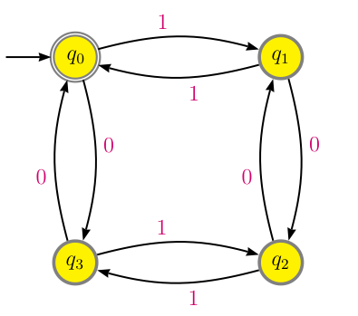

# Información General

- **Profesor**: [Olivia Gutú](https://github.com/oliviagutu)

- **Localización**: Cubículo 2, edificio 3K-4

- **Horario**: Lunes a viernes de 9:00 a 10:00 hrs.

- **Asesorías**: Estaré disponible todos los días de 14:00 a 15:00 hrs. 

- **Textos**: 
    - *Primer curso en teoría de autómatas y lenguajes formales, 2 ed.*, Olivia Gutú. Este libro está todavía en proceso de escritura, puedes bajar lo que llevo escrito [aquí](LibroAutomatas2.daEdicion.pdf). La primera edición (Pearson, 2014) la puedes sacar de la biblioteca y también la puedes comprar en la librería de la universidad. 
 
   - *Introduction to automata theory, languajes and computation, 3.ª ed*. Hopcroft, J. E.; Motwani, R. y Ullman, J., Pearson/Addison Wesley (2007). Este es un libro clásico de soporte y consulta.

# Contenido de la materia

- Alfabetos, cadenas y lenguajes
    -    Alfabetos y cadenas
    -    Lenguajes
    
- Autómatas finitos deterministas
    -    Definición de autómata finito determinista
    -    Lenguaje de un autómata finito determinista
    -    Minimización del número de estados (opcional)
    
- Autómatas finitos no-deterministas
    -    Definición de autómata finito no-determinista
    -    Autómatas con transiciones instantáneas
    -    Caracterización de los autómatas finitos
    
- Lenguajes regulares
    -    Definción de expresión y lenguaje regular
    -    De autómatas finitos a expresiones regulares
    -    De expresiones regulares a autómatas finitos
    -    Lema de bombeo para lenguajes regulares
    
- Autómatas a pila
    -    Definición de autómata a pila
    -    Descripciones instantáneas
    -    Aceptación por estado final y por pila vacía
    -    Autómatas a pila deterministas
    
- Gramáticas libres de contexto
    -    Definición de gramática
    -    Lenguaje aceptado por una gramática
    -    Árboles de derivación y ambigüedad
   
- Lenguajes libres de contexto
    -    De gramáticas a autómatas a pila
    -    De autómatas a pila a gramáticas
    -    Lema de bombeo para lenguajes libres de contexto
    -    Propiedades de los lenguajes libres de contexto
    -    Algoritmo CYK
    
- Máquinas de Turing
    -    Definición y movimientos de una máquina de Turing
    -    La máquina de Turing como algoritmo
    -    La máquina de Turing como cadena binaria
    -    Problemas decidibles y un poco de filosofía

# Calificación

La calificación del curso se realiza de la siguiente manera:

1. Exámenes semanales/quincenales (60%)
3. Examen final (20%)
4. Participación (incluye exposiciones) (20%)

## Ligas de interés

- Foro de preguntas y respuestas en matemáticas, incluyendo teora de la computación:
    -   [Stackexchange](http://cs.stackexchange.com/)

- Un simulador de autómatas y máquinas de Turing
   -    [Automatasimulator](http://automatonsimulator.com/)
   -    [Jflap](http://www.jflap.org/tutorial/pda/construct/)
   -    [Morphett](http://morphett.info/turing/turing.html)

- Para dibujar autómatas y en general máquinas de Turing en Latex
   -    [Vacauson](http://vaucanson-project.org/resources/VCManual.pdf)
   
## Avisos importantes

# Exposiciones

| Sección | Tema | Alumno(s) | Días|
| ------- | -----| ----------| ---:|
| 7.1     | De gramáticas a autómatas a pila | Liz | 25 de abril |
| 7.2     | De autómatas a gramáticas | Ricardo y Juan Carlos | 26 y 27 de abril |
| 7.3     | Lema de bombeo para lenguajes libres de contexto | Alan | 30 de abril |
| 7.4     | Propiedades de los lenguajes libres de contexto | Fran | 2 de mayo |
| 7.5     | Algoritmo de Cocke-Younger-Kasami | Ramón | 3 de mayo |
| 8.1     | Introducción a máquinas de Turing | Mario | 4 de mayo |

#  Examen final
-   Día: jueves 17 de mayo

-   Horario: 9:00-12:00 hrs.
  
-   Temas: correspondientes a las unidades 1-6. 
  
-   El mismo día del examen, entregar los siguientes ejercicios, en hojas blancas y limpias:
       
    -   Ejercicio 118 | 119  ★escoger uno
    
    -   Ejercicio 122
    
    -   Ejercicio 128
    
    -   Ejercicio 129 | 130  ★escoger uno
    
    -   Ejercicio 132
    
    -   Ejercicio 105 de la primera edición del libro de texto (el que está en la biblioteca)

